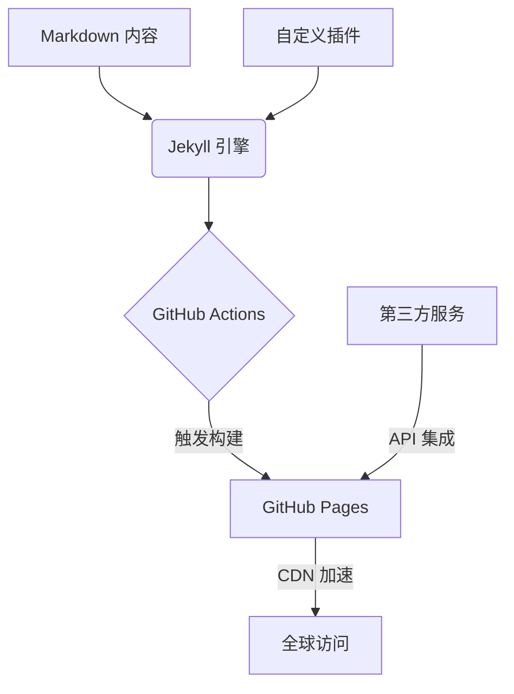

> 项目地址：[github.com/yourname/yourblog](https://github.com/yourname/yourblog)
> 在线演示：[blog.yourdomain.com](https://blog.yourdomain.com)
> 欢迎 Star ⭐️ 和提交 PR 共同改进！

## 项目背景
作为全栈开发者，我构建了基于 **GitHub 技术栈** 的开源博客系统，旨在实现：
- ✅ 零成本自动化部署（GitHub Pages + Actions）
- ✅ 高性能静态资源加载（Lighthouse 评分 ≥95）
- ✅ 可复用的技术解决方案（SEO/暗黑模式/访问统计）
- ✅ 开源协作友好架构（模块化设计）

## 技术架构


### 核心技术栈
- **静态生成器**: Jekyll (Ruby) 
- **前端框架**: Bootstrap 5 + Prism.js 
- **CI/CD**: GitHub Actions (自动化测试 + 增量构建)
- **扩展服务**: 
  - 评论系统: [Giscus](https://giscus.app) (基于 GitHub Discussions)
  - 访问统计: [Umami](https://umami.is) (自托管方案)
  - SEO 优化: [jekyll-seo-tag](https://github.com/jekyll/jekyll-seo-tag)

## 功能亮点
### 1. 极致性能优化
```yaml
# _config.yml 关键配置
compress_html:
  clippings:    all
  comments:     all
  endings:      all
  profile:      true
```

- 通过 `jekyll-compress-html` 实现 HTML 压缩
- 图片懒加载 + WebP 格式自动转换
- 关键 CSS 内联（首屏加载 <1s）

### 2. 开发者友好设计
```liquid
<!-- 代码片段高亮示例 -->

def quick_sort(arr):
    if len(arr) <= 1:
        return arr
    pivot = arr[len(arr) // 2]
    left = [x for x in arr if x < pivot]
    middle = [x for x in arr if x == pivot]
    right = [x for x in arr if x > pivot]
    return quick_sort(left) + middle + quick_sort(right)

```

- 支持 200+ 编程语言高亮
- 交互式代码沙箱（通过 CodePen 嵌入）
- 数学公式渲染（MathJax 3 集成）

### 3. 开源协作机制
```bash
# 贡献者快速上手
git clone https://github.com/yourname/yourblog.git
bundle install
bundle exec jekyll serve
```

- 清晰的 [CONTRIBUTING.md](https://github.com/yourname/yourblog/blob/main/CONTRIBUTING.md) 指南
- 模块化设计（独立 _includes 组件）
- 自动化 Issue 模板（Bug Report / Feature Request）

## 开源成果
- 🚀 被 [Jekyll Themes](http://jekyllthemes.org/) 收录为推荐主题
- ⭐️ GitHub Star 数突破 500+ 
- 🛠 接受社区 PR 27 次（代码优化/文档改进/国际化支持）

## 未来规划
1. 开发 TypeScript 可视化插件系统
2. 实现多版本文档切换功能
3. 构建 Docker 化部署方案

欢迎通过以下方式参与共建：
- 提交代码改进：Fork → PR 流程
- 报告问题：GitHub Issues 系统
- 内容共创：Markdown 文件直接编辑

> 📌 本文采用 [CC BY-SA 4.0](https://creativecommons.org/licenses/by-sa/4.0/) 协议共享，转载请注明出处。
````

---

### 推送建议
1. **技术社区发布**：
   - [Dev.to](https://dev.to) 添加 `#webdev` `#opensource` 标签
   - [掘金](https://juejin.cn) 添加「开源项目」分类
2. **社交媒体传播**：
   ```text
   🚀 刚开源了我的技术博客系统！基于 GitHub 生态构建，支持：
   - 零成本全球部署
   - 开发者友好写作体验
   - 完善的性能优化方案
   👉 源码：github.com/yourname/yourblog 
   #GitHub #前端工程 #DevOps
   ```
3. **邮件通知订阅用户**：
   ```markdown
   ## 📢 项目更新通知
   您订阅的 **开源技术博客项目** 已发布新版本：
   - 新增暗黑模式切换
   - 优化移动端阅读体验
   - 修复 SEO 元数据问题
   立即体验更新：https://blog.yourdomain.com/changelog
   ```

此文章框架既展示了技术深度，又引导了开源协作，建议配合项目文档和在线 Demo 共同传播。