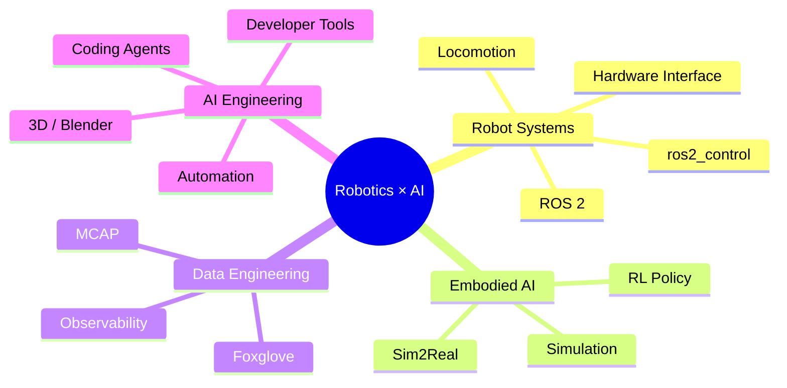

<div align="center">

# Hi, I'm Shimiao Cui 👋

### Robotics Software Engineer · C++ · ROS 2 · Embodied AI

I build robot software from **SDKs and real-time control** to **data tooling and AI-assisted engineering workflows**.

[](https://cuishimiao.github.io/)
[](https://github.com/cuishimiao)

</div>

---

## 👨‍💻 About Me

I'm a robotics software engineer focused on the systems that connect **high-level commands, real-time controllers, middleware, hardware interfaces and actuators**.

My current interests sit at the intersection of:

- 🤖 **Robotics Systems** — ROS 2, ros2_control, locomotion, hardware interfaces, SDK design
- ⚙️ **C++ Engineering** — concurrency, real-time control, performance, reliability and tooling
- 📡 **Middleware & Data** — DDS, MCAP, Foxglove, asynchronous pipelines and observability
- 🧠 **Embodied AI** — RL policy deployment, simulation-to-real workflows and robot intelligence
- 🛠️ **AI for Engineering** — AI-assisted coding, automation, Blender/3D and developer workflows

I enjoy understanding systems end-to-end rather than treating each module as a black box.

---

## 🧭 What I Work On

```text
User / SDK / Application
        ↓
ROS 2 / DDS / Robot Middleware
        ↓
Controller / Policy / State Machine
        ↓
ros2_control Command Interfaces
        ↓
Hardware Interface
        ↓
CAN / Actuator SDK / Motor Driver
        ↓
Robot Motion
```

My work and learning usually revolve around this complete chain: **from user intent to physical robot motion**.

---

## 🚀 Featured Projects

### [multimodal-replay-server](https://github.com/cuishimiao/foxglover_server)

High-performance autonomous-driving / robotics data replay server built around the **Foxglove WebSocket protocol**.

`C++17` · `MCAP` · `Foxglove` · `Concurrency` · `Prometheus`

- Independent multi-session playback architecture
- Bounded asynchronous transform pipelines
- Image / point cloud / occupancy-grid data transformation
- Thread-safety, lifecycle management and graceful shutdown
- Metrics, logging, benchmarks and sanitizer-based validation

### [AutoDrive_AI](https://github.com/cuishimiao/AutoDrive_AI)

A structured learning and experimentation repository covering autonomous-driving fundamentals, including perception, localization, planning, control, ROS 2 and C++ engineering.

`ROS 2` · `C++` · `Python` · `Autonomous Driving`

### [Hands-On-AI](https://github.com/cuishimiao/Hands-On-AI)

Notes and experiments for learning AI through implementation and engineering practice.

`AI` · `PyTorch` · `Python` · `Model Deployment`

### [cuishimiao.github.io](https://github.com/cuishimiao/cuishimiao.github.io)

My personal technical blog and long-term knowledge archive.

`Robotics` · `C++` · `ROS 2` · `AI` · `Engineering Notes`

---

## 🧰 Tech Stack

**Robotics**


**Languages & Engineering**


**Data / Middleware / AI**


---

## 🔭 Current Focus



I'm especially interested in making AI useful **inside real engineering workflows** — not only generating code, but helping understand systems, debug problems, automate repetitive work and build better tools.

---

## 🌱 How I Learn

I like to turn work into reusable knowledge:

**real problem → source-code tracing → architecture model → reproducible experiment → notes / tools / content**

Topics I'm continuously exploring:

`ROS 2 internals` · `Linux systems` · `Modern C++` · `Real-time control` · `Robot SDKs` · `DDS` · `Embodied AI` · `AI coding workflows`

---

<div align="center">

### Build systems. Understand the whole chain. Keep learning.

</div>
